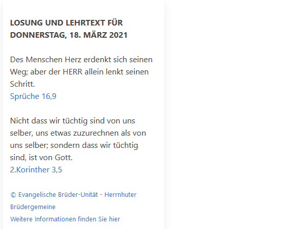

# Die Losungen
## BLUDIT - PLUGIN 
### Zeigt die aktuelle Tageslosung und den Lehrtext im Sidebar an

Die PHP-Code-Basis für die Anzeige stammt von http://www.combib.de/losungphp/index.html

Siehe auch: https://www.losungen.de/die-losungen/

bei ,ir läuft das Skript nicht , Hilfe.
https://www.weihnachtsaktion-packen-sie-mit.de/
